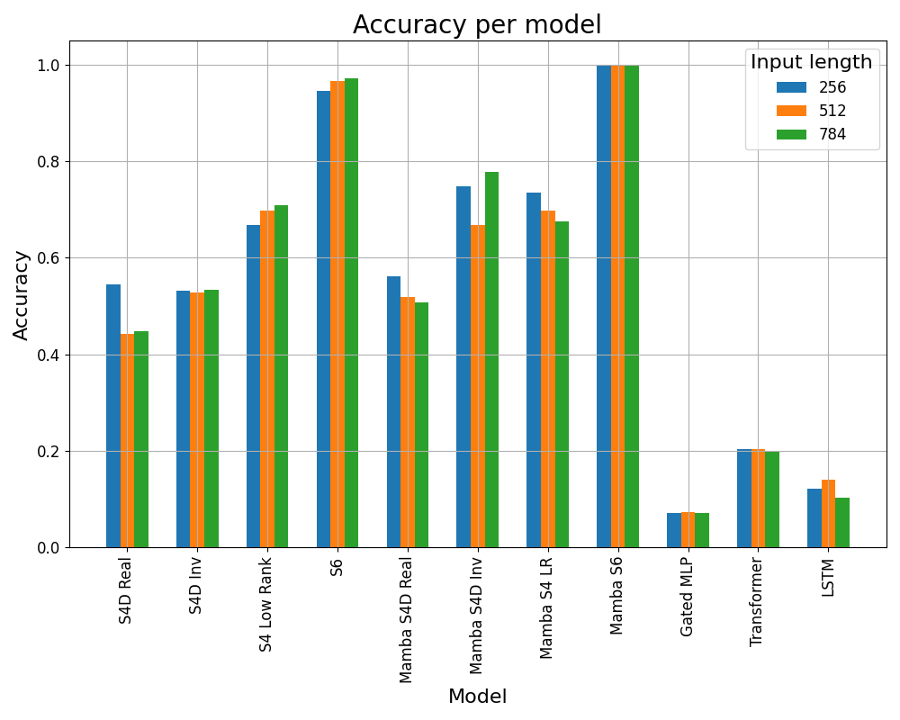
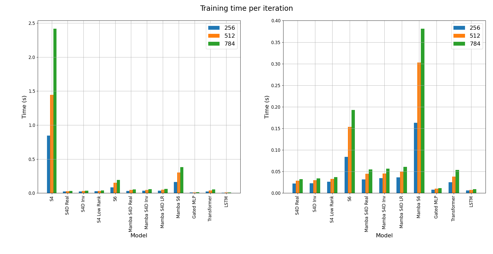
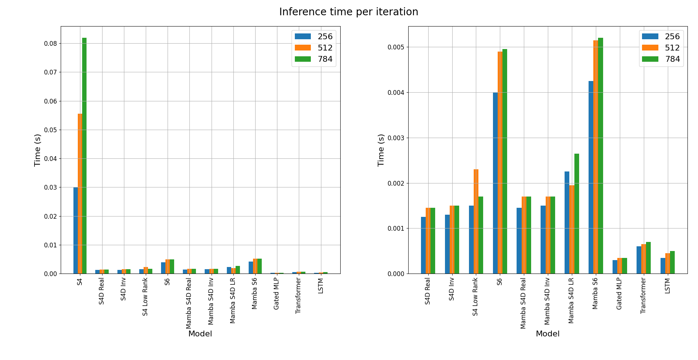
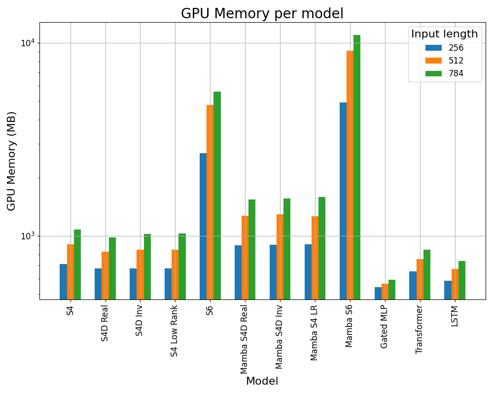
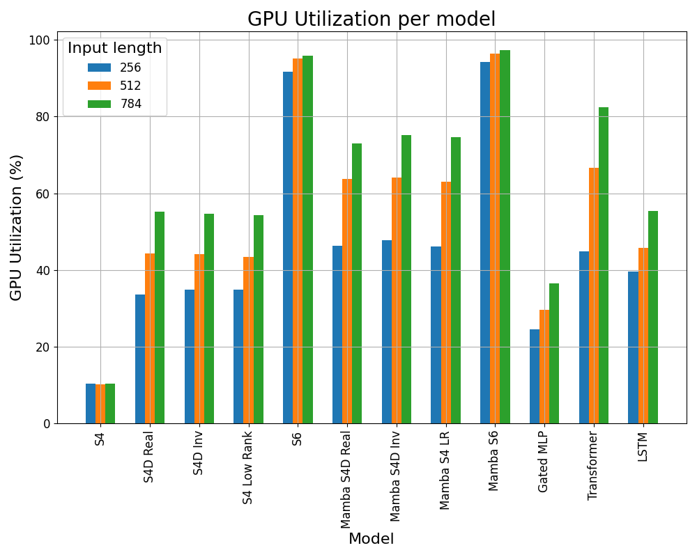

# Results

In this section we will describe the results obtained from the experiments conducted in this project. Specifically, we will focus on the following aspects:

- **Accuracy**: The performance of the model in terms of accuracy.
- **Time**: The time taken to train the model and make predictions.
- **Memory**: The amount of GPU memory used during training.
- **GPU Usage**: The GPU utilization during training.

All the test have been conducted on a single NVIDIA RTX A4000 with 16GB of GPU memory. The model have been trained on selective copy task with different input sizes (256, 512, 784) and constant number of tokens to memorize (16). The models have been trained for 200000 epochs with a batch size of 64 using Adam optimizer with a learning rate of 0.0001. Moreover, we implemented a early stopping mechanism that stops the training when the accuracy on the validation set does not improve for 5000 steps. 

## Accuracy

In this section we present the accuracy results for different models. The accuracy is measured in terms of the percentage of correct predictions made by the model on the test set. The plot below shows the accuracy results for different models.

The same data are repored in the table below:

| Model          | 256  | 512  | 784  |
|----------------|------|------|------|
| S4D Real       | 0.54 | 0.44 | 0.45 |
| S4D Inv        | 0.53 | 0.53 | 0.53 |
| S4 Low Rank    | 0.67 | 0.7  | 0.71 |
| S6             | 0.95 | 0.97 | 0.97 |
| Mamba S4D Real | 0.56 | 0.52 | 0.51 |
| Mamba S4D Inv  | 0.75 | 0.67 | 0.78 |
| Mamba S4 LR    | 0.74 | 0.7  | 0.68 |
| Mamba S6       | 1.0  | 1.0  | 1.0  |
| Gated MLP      | 0.07 | 0.07 | 0.07 |
| Transformer    | 0.2  | 0.2  | 0.2  |
| LSTM           | 0.12 | 0.14 | 0.1  |

The S6 model is the best performing model, achieving 100% accuracy on all datasets. The Mamba architecture improves the performance of the S4D models, with Mamba S6 achieving 100% accuracy. Moreover, the introduction of Mamba architecture leads always to an increase of the accuracy. The Gated MLP and Transformer models perform poorly compared to the other models, with very low accuracy. The LSTM model performs slightly better than the Gated MLP and Transformer models, but still significantly worse than the other models.

## Time

In this section we present the training and inference times for different models. 

### Training Time
Here we present the training times for different models. The training times are measured in seconds and they represent the time taken to complete a single step of training (forward + backward).

The same data are repored in the table below:

| Model          | 256    | 512    | 784    |
|----------------|--------|--------|--------|
| S4             | 169.14 | 288.95 | 483.29 |
| S4D Real       | 4.43   | 5.72   | 6.49   |
| S4D Inv        | 4.61   | 5.94   | 6.75   |
| S4 Low Rank    | 5.31   | 6.58   | 7.38   |
| S6             | 16.82  | 30.74  | 38.54  |
| Mamba S4D Real | 6.37   | 8.99   | 10.98  |
| Mamba S4D Inv  | 6.96   | 9.06   | 11.31  |
| Mamba S4D LR   | 7.35   | 9.92   | 12.14  |
| Mamba S6       | 32.6   | 60.58  | 76.23  |
| Gated MLP      | 1.56   | 2.03   | 2.28   |
| Transformer    | 5.06   | 7.59   | 10.68  |
| LSTM           | 1.24   | 1.51   | 1.79   |

From both the table and the figure we can see that the S4 model is the slowest to train, with a huge gap with the other models. The S4D models are significantly faster, with the S4D Real being the fastest. Moreover, the introduction of the Mamba architecture always lead to a significant increase of the training time. As it regard S6 model we can see that it is significantly slower than the S4D models, but still faster than the S4 model. This is due the recurrent nature of the S6 model, which requires more time to compute the forward and backward passes. A more efficient implementation of parallel scannning routine in S6 could lead to a significant speedup with performance comparable to the other architectures. As it regards LSTM and Transformer architecture, we can see that they are close to the S4D models, but way faster than S6. 

### Inference Time

Here we present the inference times for different models. The inference times are measured in seconds and they represent the time taken to complete a single step of inference (forward without gradients).

The same data are repored in the table below:

| Model          | 256  | 512   | 784   |
|----------------|------|-------|-------|
| S4             | 6.02 | 11.11 | 16.37 |
| S4D Real       | 0.25 | 0.29  | 0.29  |
| S4D Inv        | 0.26 | 0.3   | 0.3   |
| S4 Low Rank    | 0.3  | 0.46  | 0.34  |
| S6             | 0.8  | 0.98  | 0.99  |
| Mamba S4D Real | 0.29 | 0.34  | 0.34  |
| Mamba S4D Inv  | 0.3  | 0.34  | 0.34  |
| Mamba S4D LR   | 0.45 | 0.39  | 0.53  |
| Mamba S6       | 0.85 | 1.03  | 1.04  |
| Gated MLP      | 0.06 | 0.07  | 0.07  |
| Transformer    | 0.12 | 0.13  | 0.14  |
| LSTM           | 0.07 | 0.09  | 0.1   |

Comparing the results of inference times with the training times we can see that the latter are significantly higher. This is due to the fact that during training we need to compute the gradients and update the weights, while during inference we only need to compute the forward pass. The S4 model is still the slowest, but the gap with the other models is smaller. The S6 model is still slower than Transformer and LSTM based models.

## Memory

Here we present the GPU memory usage for different models. The memory usage is measured in MB and it represents the amount of GPU memory used during training. The plot below shows the memory usage for different models.

The same data are repored in the table below:

| Model          | 256    | 512    | 784     |
|----------------|--------|--------|---------|
| S4             | 715.7  | 901.7  | 1077.7  |
| S4D Real       | 677.7  | 827.7  | 983.7   |
| S4D Inv        | 679.7  | 847.7  | 1021.7  |
| S4 Low Rank    | 679.7  | 849.7  | 1027.7  |
| S6             | 2675.7 | 4763.7 | 5591.7  |
| Mamba S4D Real | 895.7  | 1273.7 | 1545.7  |
| Mamba S4D Inv  | 899.7  | 1293.7 | 1559.7  |
| Mamba S4 LR    | 903.7  | 1265.7 | 1585.7  |
| Mamba S6       | 4911.7 | 9107.7 | 10975.7 |
| Gated MLP      | 543.7  | 565.7  | 593.7   |
| Transformer    | 655.7  | 759.7  | 849.7   |
| LSTM           | 585.7  | 673.7  | 739.7   |

As we can see from both the table and the figure, all the models except S6, and its Mamba version, are using a similar amount of memory. The S6 model is the one that uses the most memory, with a huge gap with the other models. The Mamba architecture leads to a significant increase of the memory usage.

## GPU Usage

Here we present the GPU usage for different models. The GPU usage is measured in percentage and it represents the amount of GPU computational power used during
training. The plot below shows the GPU usage for different models.

The same data are repored in the table below:

| Model          | 256   | 512   | 784   |
|----------------|-------|-------|-------|
| S4             | 10.37 | 10.21 | 10.35 |
| S4D Real       | 33.51 | 44.32 | 55.28 |
| S4D Inv        | 34.82 | 44.12 | 54.56 |
| S4 Low Rank    | 34.92 | 43.32 | 54.26 |
| S6             | 91.72 | 95.14 | 95.88 |
| Mamba S4D Real | 46.34 | 63.79 | 72.9  |
| Mamba S4D Inv  | 47.84 | 64.0  | 75.12 |
| Mamba S4 LR    | 46.09 | 62.93 | 74.57 |
| Mamba S6       | 94.16 | 96.44 | 97.27 |
| Gated MLP      | 24.61 | 29.63 | 36.5  |
| Transformer    | 44.77 | 66.57 | 82.49 |
| LSTM           | 39.61 | 45.82 | 55.4  |

As we can see from both the table and the figure, the GPU utilization is quite low for all the models except S6, its Mamba version the Transformers model. Moreover, the introduction of Mamba always leads to an increase of the GPU utilization. The S4 model is the one that uses the least amount of GPU computational power: this results, combined the huge computational times confirm the inefficiency of the S4 model. As the sequence length increases, the GPU utilization increases for all the models.