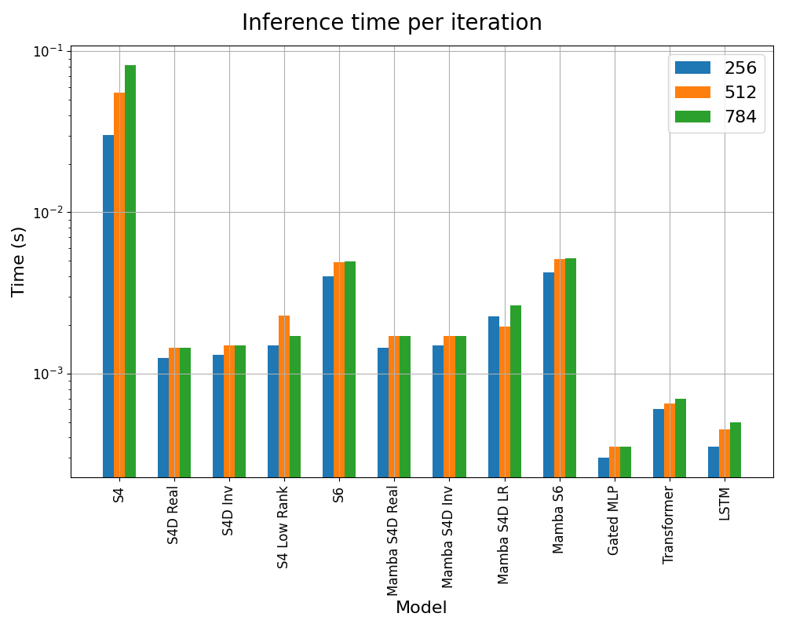

# Results

In this section we will describe the results obtained from the experiments conducted in this project. Specifically, we will focus on the following aspects:

- **Accuracy**: The performance of the model in terms of accuracy.
- **Time**: The time taken to train the model and make predictions.
- **Memory**: The amount of GPU memory used during training.
- **GPU Usage**: The GPU utilization during training.

## Accuracy

## Time

### Training Time
Here we present the training times for different models. The training times are measured in seconds and they represent the time taken to complete a single step of training (forward + backward).

The same data are repored in the table below:

| Model          | 256    | 512    | 784    |
|----------------|--------|--------|--------|
| S4             | 169.14 | 288.95 | 483.29 |
| S4D Real       | 4.43   | 5.72   | 6.49   |
| S4D Inv        | 4.61   | 5.94   | 6.75   |
| S4 Low Rank    | 5.31   | 6.58   | 7.38   |
| S6             | 16.82  | 30.74  | 38.54  |
| Mamba S4D Real | 6.37   | 8.99   | 10.98  |
| Mamba S4D Inv  | 6.96   | 9.06   | 11.31  |
| Mamba S4D LR   | 7.35   | 9.92   | 12.14  |
| Mamba S6       | 32.6   | 60.58  | 76.23  |
| Gated MLP      | 1.56   | 2.03   | 2.28   |
| Transformer    | 5.06   | 7.59   | 10.68  |
| LSTM           | 1.24   | 1.51   | 1.79   |

From both the table and the figure we can see that the S4 model is the slowest to train, with a huge gap with the other models. The S4D models are significantly faster, with the S4D Real being the fastest. Moreover, the introduction of the Mamba architecture always lead to a significant increase of the training time. As it regard S6 model we can see that it is significantly slower than the S4D models, but still faster than the S4 model. This is due the recurrent nature of the S6 model, which requires more time to compute the forward and backward passes. A more efficient implementation of parallel scannning routine in S6 could lead to a significant speedup with performance comparable to the other architectures. As it regards LSTM and Transformer architecture, we can see that they are close to the S4D models, but way faster than S6. 

### Inference Time

Here we present the inference times for different models. The inference times are measured in seconds and they represent the time taken to complete a single step of inference (forward without gradients).

The same data are repored in the table below:

| Model          | 256  | 512   | 784   |
|----------------|------|-------|-------|
| S4             | 6.02 | 11.11 | 16.37 |
| S4D Real       | 0.25 | 0.29  | 0.29  |
| S4D Inv        | 0.26 | 0.3   | 0.3   |
| S4 Low Rank    | 0.3  | 0.46  | 0.34  |
| S6             | 0.8  | 0.98  | 0.99  |
| Mamba S4D Real | 0.29 | 0.34  | 0.34  |
| Mamba S4D Inv  | 0.3  | 0.34  | 0.34  |
| Mamba S4D LR   | 0.45 | 0.39  | 0.53  |
| Mamba S6       | 0.85 | 1.03  | 1.04  |
| Gated MLP      | 0.06 | 0.07  | 0.07  |
| Transformer    | 0.12 | 0.13  | 0.14  |
| LSTM           | 0.07 | 0.09  | 0.1   |

Comparing the results of inference times with the training times we can see that the latter are significantly higher. This is due to the fact that during training we need to compute the gradients and update the weights, while during inference we only need to compute the forward pass. The S4 model is still the slowest, but the gap with the other models is smaller. The S6 model is still slower than Transformer and LSTM based models.

## Memory

## GPU Usage
